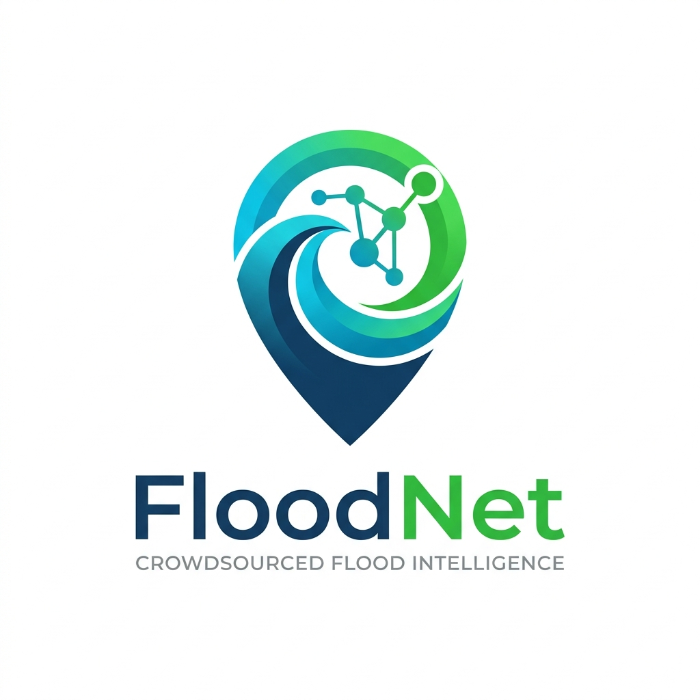

  
  <h1>FloodNet</h1>
  
<b>The Urban Eye - Navigating Safely Through the Storm</b>

  

    <a href="README.md">vi</a> | <b>en</b>
  

  

    <a href="https://floodnet.vn"><strong>Experience the power of FloodNet »</strong></a>
  

  

    
    
    
  

  

    
    
    
    
    
  

---

##  Our Story

Whenever dark clouds gather, the pulse of megacities seems to choke. Familiar streets turn into rivers, sweeping away billions in assets and thousands of precious hours. The anxiety before every decision to "keep going or stop" is a shared urban trauma.

**FloodNet** was born from a burning desire to end this. We don't build expensive hundred-million-dong sensor stations. Instead, we empower the community. Every smartphone and security camera transforms into a "smart eye," working alongside an Artificial Intelligence brain to illuminate urban flood blind spots.

---

##  Video Demo

> [!IMPORTANT]
> **Coming Soon!** 🎬 We are finalizing our demo video showcasing FloodNet's real-world impact. Stay tuned!

---

##  The Value We Create

We believe the greatest technology is the one that serves humanity silently and effectively.

- **The Asset Shield:** No more hydro-locked engines in the middle of a flooded street. FloodNet provides a true picture of water depth, giving commuters the confidence to choose the safest route.
- **The Privilege of Time:** Reclaiming millions of hours that would otherwise be lost in flood-induced traffic gridlocks.
- **Strategic Business Vision:** FloodNet's real-time data is the golden key for Logistics giants (Grab, ShopeeFood) to optimize delivery networks, and a vital safety anchor for motor insurance companies.

---

##  Core Strengths

The beauty of FloodNet lies in the seamless intersection of community power and deep tech:

- **Artificial Intelligence (YOLOv8):** Extracting truth from every pixel. Our AI measures water levels with high precision, completely eliminating human emotional bias.
- **Speed of Light (Real-time):** Every alert is instantly transmitted to the map without delay, because in a storm, every second counts.
- **Frictionless Connection:** One snap and send via Zalo OA. No app installations, no learning curve. It's so simple that anyone can become a vital node in the network.

---

##  Technology Foundation

The FloodNet ecosystem is built upon the most modern technologies, ensuring peak performance and limitless scalability:

- **Processing Core:**  Architected for stability, handling tens of thousands of real-time data streams.
- **Web Experience:**  Optimizing load speeds, delivering flood maps to users in an instant.
- **Visual Intelligence:**  The heart of the system, automatically extracting and analyzing visual data.
- **Mobile Application:**  Real-time flood alerts delivered straight to the pockets of commuters.
- **Data & Storage:**   Flexibly managing geospatial data and massive crowdsourced reporting systems.

---

##  The Journey Ahead

1. **Genesis:** Perfecting the core data pipeline via Zalo and awakening the AI engine.
2. **Harmony:** Connecting thousands of public IP cameras, expanding the system's vision to every urban corner.
3. **Prosperity:** Opening commercial API gateways, creating a high-value data ecosystem for the transport and insurance sectors.

---

  
<i>"Don't let the rain wash away the progress of our cities."</i>

  
Join FloodNet in redrawing the map of safety.

  
<b>Partner with us:</b> cuquangtuoi11@gmail.com

  
MIT License © 2026 FloodNet Team

